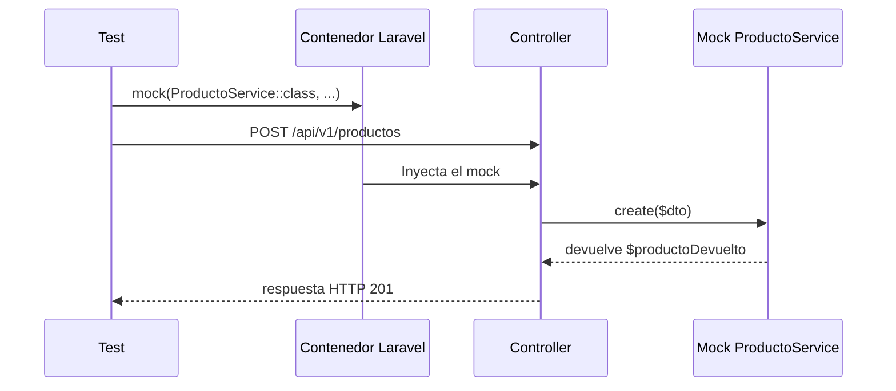

El mock se configura aquí:

```php
$this->mock(ProductoService::class, function (MockInterface $mock) use ($productoDevuelto): void {
    $mock->shouldReceive('create')
        ->once()
        ->andReturn($productoDevuelto);
});
```

Pero se **usa realmente** después, de forma indirecta, al ejecutar:

```php
$this->withToken($token)->postJson('/api/v1/productos', $datosProducto);
```

Ese `postJson()` entra a la ruta, llega al controlador y Laravel necesita resolver `ProductoService` para inyectarlo. Como el test registró antes un mock de `ProductoService` en el contenedor, Laravel entrega el mock en vez del servicio real.

Entonces, cuando el controlador hace algo equivalente a:

```php
$this->productoService->create($dto);
```

no se ejecuta el método `create()` verdadero ni se guarda un producto en la base. Mockery intercepta la llamada, comprueba que ocurra exactamente una vez por `->once()` y devuelve `$productoDevuelto` mediante `->andReturn(...)`.

La secuencia es:



Por eso este test ya **no prueba la lógica interna de `ProductoService::create()`**. Prueba que el endpoint:

- autentica y valida lo necesario para llegar al controlador;
- delega el alta al servicio;
- llama a `create()` una única vez;
- responde `201` usando el producto que el mock devuelve.